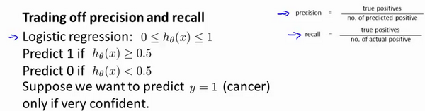

十一、机器学习系统的设计(Machine Learning System Design)
--------------------------------------------------------

### 11.1 首先要做什么

参考视频: 11 - 1 - Prioritizing What to Work On (10 min).mkv

在接下来的视频中，我将谈到机器学习系统的设计。这些视频将谈及在设计复杂的机器学习系统时，你将遇到的主要问题。同时我们会试着给出一些关于如何巧妙构建一个复杂的机器学习系统的建议。下面的课程的的数学性可能不是那么强，但是我认为我们将要讲到的这些东西是非常有用的，可能在构建大型的机器学习系统时，节省大量的时间。
	
本周以一个垃圾邮件分类器算法为例进行讨论。
	
为了解决这样一个问题，我们首先要做的决定是如何选择并表达特征向量$x$。我们可以选择一个由100个最常出现在垃圾邮件中的词所构成的列表，根据这些词是否有在邮件中出现，来获得我们的特征向量（出现为1，不出现为0），尺寸为100×1。

为了构建这个分类器算法，我们可以做很多事，例如：

1. 收集更多的数据，让我们有更多的垃圾邮件和非垃圾邮件的样本

2. 基于邮件的路由信息开发一系列复杂的特征

3. 基于邮件的正文信息开发一系列复杂的特征，包括考虑截词的处理

4. 为探测刻意的拼写错误（把**watch** 写成**w4tch**）开发复杂的算法

在上面这些选项中，非常难决定应该在哪一项上花费时间和精力，作出明智的选择，比随着感觉走要更好。当我们使用机器学习时，总是可以“头脑风暴”一下，想出一堆方法来试试。实际上，当你需要通过头脑风暴来想出不同方法来尝试去提高精度的时候，你可能已经超越了很多人了。大部分人并不尝试着列出可能的方法，他们做的只是某天早上醒来，因为某些原因有了一个突发奇想："让我们来试试用**Honey Pot**项目收集大量的数据吧。"
    
我们将在随后的课程中讲误差分析，我会告诉你怎样用一个更加系统性的方法，从一堆不同的方法中，选取合适的那一个。因此，你更有可能选择一个真正的好方法，能让你花上几天几周，甚至是几个月去进行深入的研究。

### 11.2 误差分析

参考视频: 11 - 2 - Error Analysis (13 min).mkv

在本次课程中，我们将会讲到误差分析（**Error Analysis**）的概念。这会帮助你更系统地做出决定。如果你准备研究机器学习的东西，或者构造机器学习应用程序，最好的实践方法不是建立一个非常复杂的系统，拥有多么复杂的变量；而是构建一个简单的算法，这样你可以很快地实现它。
	
每当我研究机器学习的问题时，我最多只会花一天的时间，就是字面意义上的24小时，来试图很快的把结果搞出来，即便效果不好。坦白的说，就是根本没有用复杂的系统，但是只是很快的得到的结果。即便运行得不完美，但是也把它运行一遍，最后通过交叉验证来检验数据。一旦做完，你可以画出学习曲线，通过画出学习曲线，以及检验误差，来找出你的算法是否有高偏差和高方差的问题，或者别的问题。在这样分析之后，再来决定用更多的数据训练，或者加入更多的特征变量是否有用。这么做的原因是：这在你刚接触机器学习问题时是一个很好的方法，你并不能提前知道你是否需要复杂的特征变量，或者你是否需要更多的数据，还是别的什么。提前知道你应该做什么，是非常难的，因为你缺少证据，缺少学习曲线。因此，你很难知道你应该把时间花在什么地方来提高算法的表现。但是当你实践一个非常简单即便不完美的方法时，你可以通过画出学习曲线来做出进一步的选择。你可以用这种方式来避免一种电脑编程里的过早优化问题，这种理念是：我们必须用证据来领导我们的决策，怎样分配自己的时间来优化算法，而不是仅仅凭直觉，凭直觉得出的东西一般总是错误的。除了画出学习曲线之外，一件非常有用的事是误差分析，我的意思是说：当我们在构造垃圾邮件分类器时，我会看一看我的交叉验证数据集，然后亲自看一看哪些邮件被算法错误地分类。因此，通过这些被算法错误分类的垃圾邮件与非垃圾邮件，你可以发现某些系统性的规律：什么类型的邮件总是被错误分类。经常地这样做之后，这个过程能启发你构造新的特征变量，或者告诉你：现在这个系统的短处，然后启发你如何去提高它。
	
构建一个学习算法的推荐方法为：
	

1. 从一个简单的能快速实现的算法开始，实现该算法并用交叉验证集数据测试这个算法

2.绘制学习曲线，决定是增加更多数据，或者添加更多特征，还是其他选择
	
3.进行误差分析：人工检查交叉验证集中我们算法中产生预测误差的样本，看看这些样本是否有某种系统化的趋势

以我们的垃圾邮件过滤器为例，误差分析要做的既是检验交叉验证集中我们的算法产生错误预测的所有邮件，看：是否能将这些邮件按照类分组。例如医药品垃圾邮件，仿冒品垃圾邮件或者密码窃取邮件等。然后看分类器对哪一组邮件的预测误差最大，并着手优化。
	
思考怎样能改进分类器。例如，发现是否缺少某些特征，记下这些特征出现的次数。
	
例如记录下错误拼写出现了多少次，异常的邮件路由情况出现了多少次等等，然后从出现次数最多的情况开始着手优化。
	
误差分析并不总能帮助我们判断应该采取怎样的行动。有时我们需要尝试不同的模型，然后进行比较，在模型比较时，用数值来判断哪一个模型更好更有效，通常我们是看交叉验证集的误差。
	
在我们的垃圾邮件分类器例子中，对于“我们是否应该将**discount/discounts/discounted/discounting**处理成同一个词？”如果这样做可以改善我们算法，我们会采用一些截词软件。误差分析不能帮助我们做出这类判断，我们只能尝试采用和不采用截词软件这两种不同方案，然后根据数值检验的结果来判断哪一种更好。
	
因此，当你在构造学习算法的时候，你总是会去尝试很多新的想法，实现出很多版本的学习算法，如果每一次你实践新想法的时候，你都要手动地检测这些例子，去看看是表现差还是表现好，那么这很难让你做出决定。到底是否使用词干提取，是否区分大小写。但是通过一个量化的数值评估，你可以看看这个数字，误差是变大还是变小了。你可以通过它更快地实践你的新想法，它基本上非常直观地告诉你：你的想法是提高了算法表现，还是让它变得更坏，这会大大提高你实践算法时的速度。所以我强烈推荐在交叉验证集上来实施误差分析，而不是在测试集上。但是，还是有一些人会在测试集上来做误差分析。即使这从数学上讲是不合适的。所以我还是推荐你在交叉验证向量上来做误差分析。
	
总结一下，当你在研究一个新的机器学习问题时，我总是推荐你实现一个较为简单快速、即便不是那么完美的算法。我几乎从未见过人们这样做。大家经常干的事情是：花费大量的时间在构造算法上，构造他们以为的简单的方法。因此，不要担心你的算法太简单，或者太不完美，而是尽可能快地实现你的算法。当你有了初始的实现之后，它会变成一个非常有力的工具，来帮助你决定下一步的做法。因为我们可以先看看算法造成的错误，通过误差分析，来看看他犯了什么错，然后来决定优化的方式。另一件事是：假设你有了一个快速而不完美的算法实现，又有一个数值的评估数据，这会帮助你尝试新的想法，快速地发现你尝试的这些想法是否能够提高算法的表现，从而你会更快地做出决定，在算法中放弃什么，吸收什么误差分析可以帮助我们系统化地选择该做什么。

### 11.3 类偏斜的误差度量

参考视频: 11 - 3 - Error Metrics for Skewed Classes (12 min).mkv

在前面的课程中，我提到了误差分析，以及设定误差度量值的重要性。那就是，设定某个实数来评估你的学习算法，并衡量它的表现，有了算法的评估和误差度量值。有一件重要的事情要注意，就是使用一个合适的误差度量值，这有时会对于你的学习算法造成非常微妙的影响，这件重要的事情就是偏斜类（skewed classes）的问题。类偏斜情况表现为我们的训练集中有非常多的同一种类的样本，只有很少或没有其他类的样本。
	
例如我们希望用算法来预测癌症是否是恶性的，在我们的训练集中，只有0.5%的实例是恶性肿瘤。假设我们编写一个非学习而来的算法，在所有情况下都预测肿瘤是良性的，那么误差只有0.5%。然而我们通过训练而得到的神经网络算法却有1%的误差。这时，误差的大小是不能视为评判算法效果的依据的。
	
**查准率**（**Precision**）和**查全率**（**Recall**） 我们将算法预测的结果分成四种情况：
	

1. **正确肯定**（**True Positive,TP**）：预测为真，实际为真

2.**正确否定**（**True Negative,TN**）：预测为假，实际为假
	
3.**错误肯定**（**False Positive,FP**）：预测为真，实际为假
	
4.**错误否定**（**False Negative,FN**）：预测为假，实际为真

则：查准率=**TP/(TP+FP)**。例，在所有我们预测有恶性肿瘤的病人中，实际上有恶性肿瘤的病人的百分比，越高越好。
	
查全率=**TP/(TP+FN)**。例，在所有实际上有恶性肿瘤的病人中，成功预测有恶性肿瘤的病人的百分比，越高越好。
	
这样，对于我们刚才那个总是预测病人肿瘤为良性的算法，其查全率是0。

|            |              | **预测值**   |             |
| ---------- | ------------ | ------------ | ----------- |
|            |              | **Positive** | **Negtive** |
| **实际值** | **Positive** | **TP**       | **FN**      |
|            | **Negtive**  | **FP**       | **TN**      |

### 11.4 查准率和查全率之间的权衡

参考视频: 11 - 4 - Trading Off Precision and Recall (14 min).mkv

在之前的课程中，我们谈到查准率和召回率，作为遇到偏斜类问题的评估度量值。在很多应用中，我们希望能够保证查准率和召回率的相对平衡。
	
在这节课中，我将告诉你应该怎么做，同时也向你展示一些查准率和召回率作为算法评估度量值的更有效的方式。继续沿用刚才预测肿瘤性质的例子。假使，我们的算法输出的结果在0-1 之间，我们使用阀值0.5 来预测真和假。

查准率**(Precision)=TP/(TP+FP)**
例，在所有我们预测有恶性肿瘤的病人中，实际上有恶性肿瘤的病人的百分比，越高越好。

查全率**(Recall)=TP/(TP+FN)**例，在所有实际上有恶性肿瘤的病人中，成功预测有恶性肿瘤的病人的百分比，越高越好。
	
如果我们希望只在非常确信的情况下预测为真（肿瘤为恶性），即我们希望更高的查准率，我们可以使用比0.5更大的阀值，如0.7，0.9。这样做我们会减少错误预测病人为恶性肿瘤的情况，同时却会增加未能成功预测肿瘤为恶性的情况。
	
如果我们希望提高查全率，尽可能地让所有有可能是恶性肿瘤的病人都得到进一步地检查、诊断，我们可以使用比0.5更小的阀值，如0.3。
	
我们可以将不同阀值情况下，查全率与查准率的关系绘制成图表，曲线的形状根据数据的不同而不同：

我们希望有一个帮助我们选择这个阀值的方法。一种方法是计算**F1 值**（**F1 Score**），其计算公式为：

${{F}_{1}}Score:2\frac{PR}{P+R}$

我们选择使得**F1**值最高的阀值。

### 11.5 机器学习的数据

参考视频: 11 - 5 - Data For Machine Learning (11 min).mkv

在之前的视频中，我们讨论了评价指标。在这个视频中，我要稍微转换一下，讨论一下机器学习系统设计中另一个重要的方面，这往往涉及到用来训练的数据有多少。在之前的一些视频中，我曾告诫大家不要盲目地开始，而是花大量的时间来收集大量的数据，因为数据有时是唯一能实际起到作用的。但事实证明，在一定条件下，我会在这个视频里讲到这些条件是什么。得到大量的数据并在某种类型的学习算法中进行训练，可以是一种有效的方法来获得一个具有良好性能的学习算法。而这种情况往往出现在这些条件对于你的问题都成立。
并且你能够得到大量数据的情况下。这可以是一个很好的方式来获得非常高性能的学习算法。因此，在这段视频中，让我们一起讨论一下这个问题。

很多很多年前，我认识的两位研究人员**Michele Banko** 和**Eric Brill**进行了一项有趣的研究，他们尝试通过机器学习算法来区分常见的易混淆的单词，他们尝试了许多种不同的算法，并发现数据量非常大时，这些不同类型的算法效果都很好。

比如，在这样的句子中：早餐我吃了__个鸡蛋(**to**,**two**,**too**)，在这个例子中，“早餐我吃了2个鸡蛋”，这是一个易混淆的单词的例子。于是他们把诸如这样的机器学习问题，当做一类监督学习问题，并尝试将其分类，什么样的词，在一个英文句子特定的位置，才是合适的。他们用了几种不同的学习算法，这些算法都是在他们2001年进行研究的时候，都已经被公认是比较领先的。因此他们使用了一个方差，用于逻辑回归上的一个方差，被称作"感知器"(**perceptron**)。他们也采取了一些过去常用，但是现在比较少用的算法，比如 **Winnow**算法，很类似于回归问题，但在一些方面又有所不同，过去用得比较多，但现在用得不太多。还有一种基于内存的学习算法，现在也用得比较少了，但是我稍后会讨论一点，而且他们用了一个朴素算法。这些具体算法的细节不那么重要，我们下面希望探讨，什么时候我们会希望获得更多数据，而非修改算法。他们所做的就是改变了训练数据集的大小，并尝试将这些学习算法用于不同大小的训练数据集中，这就是他们得到的结果。

这些趋势非常明显，首先大部分算法，都具有相似的性能，其次，随着训练数据集的增大，在横轴上代表以百万为单位的训练集大小，从0.1个百万到1000百万，也就是到了10亿规模的训练集的样本，这些算法的性能也都对应地增强了。
	
事实上，如果你选择任意一个算法，可能是选择了一个"劣等的"算法，如果你给这个劣等算法更多的数据，那么从这些例子中看起来的话，它看上去很有可能会其他算法更好，甚至会比"优等算法"更好。由于这项原始的研究非常具有影响力，因此已经有一系列许多不同的研究显示了类似的结果。这些结果表明，许多不同的学习算法有时倾向于表现出非常相似的表现，这还取决于一些细节，但是真正能提高性能的，是你能够给一个算法大量的训练数据。像这样的结果，引起了一种在机器学习中的普遍共识："取得成功的人不是拥有最好算法的人，而是拥有最多数据的人"。
	
那么这种说法在什么时候是真，什么时候是假呢？因为如果我们有一个学习算法，并且如果这种说法是真的，那么得到大量的数据通常是保证我们具有一个高性能算法的最佳方式，而不是去争辩应该用什么样的算法。
	
假如有这样一些假设，在这些假设下有大量我们认为有用的训练集，我们假设在我们的机器学习问题中，特征值$x$包含了足够的信息，这些信息可以帮助我们用来准确地预测$y$，例如，如果我们采用了一些容易混淆的词，如：**two**、**to**、**too**，假如说它能够描述$x$，捕捉到需要填写的空白处周围的词语，那么特征捕捉到之后，我们就希望有对于“早饭我吃了__鸡蛋”，那么这就有大量的信息来告诉我中间我需要填的词是“两个”(**two**)，而不是单词 **to** 或**too**，因此特征捕捉，哪怕是周围词语中的一个词，就能够给我足够的信息来确定出标签 $y$是什么。换句话说，从这三组易混淆的词中，我应该选什么词来填空。
	
那么让我们来看一看，大量的数据是有帮助的情况。假设特征值有足够的信息来预测$y$值，假设我们使用一种需要大量参数的学习算法，比如有很多特征的逻辑回归或线性回归，或者用带有许多隐藏单元的神经网络，那又是另外一种带有很多参数的学习算法，这些都是非常强大的学习算法，它们有很多参数，这些参数可以拟合非常复杂的函数，因此我要调用这些，我将把这些算法想象成低偏差算法，因为我们能够拟合非常复杂的函数，而且因为我们有非常强大的学习算法，这些学习算法能够拟合非常复杂的函数。很有可能，如果我们用这些数据运行这些算法，这种算法能很好地拟合训练集，因此，训练误差就会很低了。
	
现在假设我们使用了非常非常大的训练集，在这种情况下，尽管我们希望有很多参数，但是如果训练集比参数的数量还大，甚至是更多，那么这些算法就不太可能会过度拟合。也就是说训练误差有希望接近测试误差。
	
另一种考虑这个问题的角度是为了有一个高性能的学习算法，我们希望它不要有高的偏差和方差。
	
因此偏差问题，我么将通过确保有一个具有很多参数的学习算法来解决，以便我们能够得到一个较低偏差的算法，并且通过用非常大的训练集来保证。

我们在此没有方差问题，我们的算法将没有方差，并且通过将这两个值放在一起，我们最终可以得到一个低误差和低方差的学习算法。这使得我们能够很好地测试测试数据集。从根本上来说，这是一个关键的假设：特征值有足够的信息量，且我们有一类很好的函数，这是为什么能保证低误差的关键所在。它有大量的训练数据集，这能保证得到更多的方差值，因此这给我们提出了一些可能的条件，如果你有大量的数据，而且你训练了一种带有很多参数的学习算法，那么这将会是一个很好的方式，来提供一个高性能的学习算法。
	
我觉得关键的测试：首先，一个人类专家看到了特征值 $x$，能很有信心的预测出$y$值吗？因为这可以证明 $ y$ 可以根据特征值$x$被准确地预测出来。其次，我们实际上能得到一组庞大的训练集，并且在这个训练集中训练一个有很多参数的学习算法吗？如果你不能做到这两者，那么更多时候，你会得到一个性能很好的学习算法。

