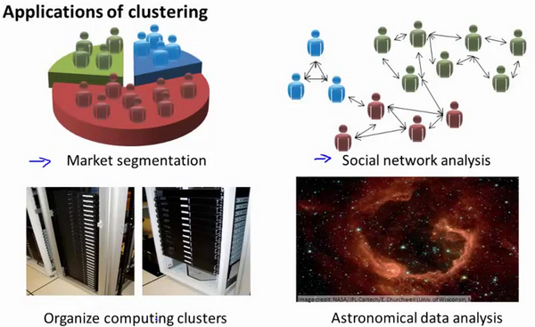
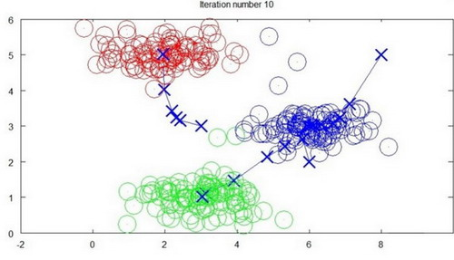
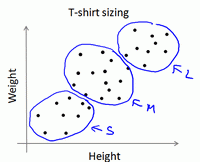
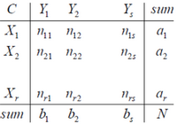

十三、聚类(Clustering)
----------------------

### 13.1 无监督学习：简介

参考视频: 13 - 1 - Unsupervised Learning\_ Introduction (3 min).mkv

在这个视频中，我将开始介绍聚类算法。这将是一个激动人心的时刻，因为这是我们学习的第一个非监督学习算法。我们将要让计算机学习无标签数据，而不是此前的标签数据。

那么，什么是非监督学习呢？在课程的一开始，我曾简单的介绍过非监督学习，然而，我们还是有必要将其与监督学习做一下比较。

在一个典型的监督学习中，我们有一个有标签的训练集，我们的目标是找到能够区分正样本和负样本的决策边界，在这里的监督学习中，我们有一系列标签，我们需要据此拟合一个假设函数。与此不同的是，在非监督学习中，我们的数据没有附带任何标签，我们拿到的数据就是这样的：


在这里我们有一系列点，却没有标签。因此，我们的训练集可以写成只有$x^{(1)}$,$x^{(2)}$…..一直到$x^{(m)}$。我们没有任何标签$y$。因此，图上画的这些点没有标签信息。也就是说，在非监督学习中，我们需要将一系列无标签的训练数据，输入到一个算法中，然后我们告诉这个算法，快去为我们找找这个数据的内在结构给定数据。我们可能需要某种算法帮助我们寻找一种结构。图上的数据看起来可以分成两个分开的点集（称为簇），一个能够找到我圈出的这些点集的算法，就被称为聚类算法。


这将是我们介绍的第一个非监督学习算法。当然，此后我们还将提到其他类型的非监督学习算法，它们可以为我们找到其他类型的结构或者其他的一些模式，而不只是簇。

我们将先介绍聚类算法。此后，我们将陆续介绍其他算法。那么聚类算法一般用来做什么呢？



在这门课程的早些时候，我曾经列举过一些应用：比如市场分割。也许你在数据库中存储了许多客户的信息，而你希望将他们分成不同的客户群，这样你可以对不同类型的客户分别销售产品或者分别提供更适合的服务。社交网络分析：事实上有许多研究人员正在研究这样一些内容，他们关注一群人，关注社交网络，例如**Facebook**，**Google+**，或者是其他的一些信息，比如说：你经常跟哪些人联系，而这些人又经常给哪些人发邮件，由此找到关系密切的人群。因此，这可能需要另一个聚类算法，你希望用它发现社交网络中关系密切的朋友。我有一个朋友正在研究这个问题，他希望使用聚类算法来更好的组织计算机集群，或者更好的管理数据中心。因为如果你知道数据中心中，那些计算机经常协作工作。那么，你可以重新分配资源，重新布局网络。由此优化数据中心，优化数据通信。

最后，我实际上还在研究如何利用聚类算法了解星系的形成。然后用这个知识，了解一些天文学上的细节问题。好的，这就是聚类算法。这将是我们介绍的第一个非监督学习算法。在下一个视频中，我们将开始介绍一个具体的聚类算法。

### 13.2 K-均值算法

参考视频: 13 - 2 - K-Means Algorithm (13 min).mkv

**K-均值**是最普及的聚类算法，算法接受一个未标记的数据集，然后将数据聚类成不同的组。

**K-均值**是一个迭代算法，假设我们想要将数据聚类成n个组，其方法为:

首先选择$K$个随机的点，称为**聚类中心**（**cluster centroids**）；

对于数据集中的每一个数据，按照距离$K$个中心点的距离，将其与距离最近的中心点关联起来，与同一个中心点关联的所有点聚成一类。

计算每一个组的平均值，将该组所关联的中心点移动到平均值的位置。

重复步骤2-4直至中心点不再变化。

下面是一个聚类示例：


迭代 1 次


迭代 3 次



迭代 10 次

用$μ^1$,$μ^2$,...,$μ^k$ 来表示聚类中心，用$c^{(1)}$,$c^{(2)}$,...,$c^{(m)}$来存储与第$i$个实例数据最近的聚类中心的索引，**K-均值**算法的伪代码如下：

```
Repeat {

for i = 1 to m

c(i) := index (form 1 to K) of cluster centroid closest to x(i)

for k = 1 to K

μk := average (mean) of points assigned to cluster k

}
```

算法分为两个步骤，第一个**for**循环是赋值步骤，即：对于每一个样例$i$，计算其应该属于的类。第二个**for**循环是聚类中心的移动，即：对于每一个类$K$，重新计算该类的质心。

**K-均值**算法也可以很便利地用于将数据分为许多不同组，即使在没有非常明显区分的组群的情况下也可以。下图所示的数据集包含身高和体重两项特征构成的，利用**K-均值**算法将数据分为三类，用于帮助确定将要生产的T-恤衫的三种尺寸。



### 13.3 优化目标

参考视频: 13 - 3 - Optimization Objective (7 min).mkv

K-均值最小化问题，是要最小化所有的数据点与其所关联的聚类中心点之间的距离之和，因此
K-均值的代价函数（又称**畸变函数** **Distortion function**）为：

$$J(c^{(1)},...,c^{(m)},μ_1,...,μ_K)=\dfrac {1}{m}\sum^{m}_{i=1}\left\| X^{\left( i\right) }-\mu_{c^{(i)}}\right\| ^{2}$$

其中${{\mu }_{{{c}^{(i)}}}}$代表与${{x}^{(i)}}$最近的聚类中心点。
我们的的优化目标便是找出使得代价函数最小的 $c^{(1)}$,$c^{(2)}$,...,$c^{(m)}$和$μ^1$,$μ^2$,...,$μ^k$：


回顾刚才给出的:
**K-均值**迭代算法，我们知道，第一个循环是用于减小$c^{(i)}$引起的代价，而第二个循环则是用于减小${{\mu }_{i}}$引起的代价。迭代的过程一定会是每一次迭代都在减小代价函数，不然便是出现了错误。

### 13.4 随机初始化

参考视频: 13 - 4 - Random Initialization (8 min).mkv

在运行K-均值算法的之前，我们首先要随机初始化所有的聚类中心点，下面介绍怎样做：

1. 我们应该选择$K<m$，即聚类中心点的个数要小于所有训练集实例的数量

2. 随机选择$K$个训练实例，然后令$K$个聚类中心分别与这$K$个训练实例相等

**K-均值**的一个问题在于，它有可能会停留在一个局部最小值处，而这取决于初始化的情况。


为了解决这个问题，我们通常需要多次运行**K-均值**算法，每一次都重新进行随机初始化，最后再比较多次运行**K-均值**的结果，选择代价函数最小的结果。这种方法在$K$较小的时候（2--10）还是可行的，但是如果$K$较大，这么做也可能不会有明显地改善。

### 13.5 选择聚类数

参考视频: 13 - 5 - Choosing the Number of Clusters (8 min).mkv

没有所谓最好的选择聚类数的方法，通常是需要根据不同的问题，人工进行选择的。选择的时候思考我们运用**K-均值**算法聚类的动机是什么，然后选择能最好服务于该目的标聚类数。

当人们在讨论，选择聚类数目的方法时，有一个可能会谈及的方法叫作“肘部法则”。关于“肘部法则”，我们所需要做的是改变$K$值，也就是聚类类别数目的总数。我们用一个聚类来运行**K均值**聚类方法。这就意味着，所有的数据都会分到一个聚类里，然后计算成本函数或者计算畸变函数$J$。$K$代表聚类数字。


我们可能会得到一条类似于这样的曲线。像一个人的肘部。这就是“肘部法则”所做的，让我们来看这样一个图，看起来就好像有一个很清楚的肘在那儿。好像人的手臂，如果你伸出你的胳膊，那么这就是你的肩关节、肘关节、手。这就是“肘部法则”。你会发现这种模式，它的畸变值会迅速下降，从1到2，从2到3之后，你会在3的时候达到一个肘点。在此之后，畸变值就下降的非常慢，看起来就像使用3个聚类来进行聚类是正确的，这是因为那个点是曲线的肘点，畸变值下降得很快，$K=3$之后就下降得很慢，那么我们就选$K=3$。当你应用“肘部法则”的时候，如果你得到了一个像上面这样的图，那么这将是一种用来选择聚类个数的合理方法。

例如，我们的 T-恤制造例子中，我们要将用户按照身材聚类，我们可以分成3个尺寸:$S,M,L$，也可以分成5个尺寸$XS,S,M,L,XL$，这样的选择是建立在回答“聚类后我们制造的T-恤是否能较好地适合我们的客户”这个问题的基础上作出的。

**聚类参考资料：**

1.相似度/距离计算方法总结

(1). 闵可夫斯基距离**Minkowski**/（其中欧式距离：$p=2$) 

$dist(X,Y)={{\left( {{\sum\limits_{i=1}^{n}{\left| {{x}_{i}}-{{y}_{i}} \right|}}^{p}} \right)}^{\frac{1}{p}}}$

(2). 杰卡德相似系数(**Jaccard**)：

$J(A,B)=\frac{\left| A\cap B \right|}{\left|A\cup B \right|}$

(3). 余弦相似度(**cosine similarity**)：

$n$维向量$x$和$y$的夹角记做$\theta$，根据余弦定理，其余弦值为：

$cos (\theta )=\frac{{{x}^{T}}y}{\left|x \right|\cdot \left| y \right|}=\frac{\sum\limits_{i=1}^{n}{{{x}_{i}}{{y}_{i}}}}{\sqrt{\sum\limits_{i=1}^{n}{{{x}_{i}}^{2}}}\sqrt{\sum\limits_{i=1}^{n}{{{y}_{i}}^{2}}}}$
(4). Pearson皮尔逊相关系数：
${{\rho }_{XY}}=\frac{\operatorname{cov}(X,Y)}{{{\sigma }_{X}}{{\sigma }_{Y}}}=\frac{E[(X-{{\mu }_{X}})(Y-{{\mu }_{Y}})]}{{{\sigma }_{X}}{{\sigma }_{Y}}}=\frac{\sum\limits_{i=1}^{n}{(x-{{\mu }_{X}})(y-{{\mu }_{Y}})}}{\sqrt{\sum\limits_{i=1}^{n}{{{(x-{{\mu }_{X}})}^{2}}}}\sqrt{\sum\limits_{i=1}^{n}{{{(y-{{\mu }_{Y}})}^{2}}}}}$

Pearson相关系数即将$x$、$y$坐标向量各自平移到原点后的夹角余弦。

2.聚类的衡量指标

(1). 均一性：$p$

类似于精确率，一个簇中只包含一个类别的样本，则满足均一性。其实也可以认为就是正确率(每个 聚簇中正确分类的样本数占该聚簇总样本数的比例和)

(2). 完整性：$r$

类似于召回率，同类别样本被归类到相同簇中，则满足完整性;每个聚簇中正确分类的样本数占该 
类型的总样本数比例的和

(3). **V-measure**:

均一性和完整性的加权平均 

$V = \frac{(1+\beta^2)*pr}{\beta^2*p+r}$

(4). 轮廓系数

样本$i$的轮廓系数：$s(i)$

簇内不相似度:计算样本$i$到同簇其它样本的平均距离为$a(i)$，应尽可能小。

簇间不相似度:计算样本$i$到其它簇$C_j$的所有样本的平均距离$b_{ij}$，应尽可能大。

轮廓系数：$s(i)$值越接近1表示样本$i$聚类越合理，越接近-1，表示样本$i$应该分类到 另外的簇中，近似为0，表示样本$i$应该在边界上;所有样本的$s(i)$的均值被成为聚类结果的轮廓系数。 

$s(i) = \frac{b(i)-a(i)}{max\{a(i),b(i)\}}$

(5). **ARI**

数据集$S$共有$N$个元素，  两个聚类结果分别是：

$X=\{{{X}_{1}},{{X}_{2}},...,{{X}_{r}}\},Y=\{{{Y}_{1}},{{Y}_{2}},...,{{Y}_{s}}\}$

$X$和$Y$的元素个数为：

$a=\{{{a}_{1}},{{a}_{2}},...,{{a}_{r}}\},b=\{{{b}_{1}},{{b}_{2}},...,{{b}_{s}}\}$



记：${{n}_{ij}}=\left| {{X}_{i}}\cap {{Y}_{i}} \right|$

$ARI=\frac{\sum\limits_{i,j}{C_{{{n}_{ij}}}^{2}}-\left[ \left( \sum\limits_{i}{C_{{{a}_{i}}}^{2}} \right)\cdot \left( \sum\limits_{i}{C_{{{b}_{i}}}^{2}} \right) \right]/C_{n}^{2}}{\frac{1}{2}\left[ \left( \sum\limits_{i}{C_{{{a}_{i}}}^{2}} \right)+\left( \sum\limits_{i}{C_{{{b}_{i}}}^{2}} \right) \right]-\left[ \left( \sum\limits_{i}{C_{{{a}_{i}}}^{2}} \right)\cdot \left( \sum\limits_{i}{C_{{{b}_{i}}}^{2}} \right) \right]/C_{n}^{2}}$