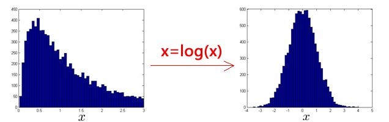
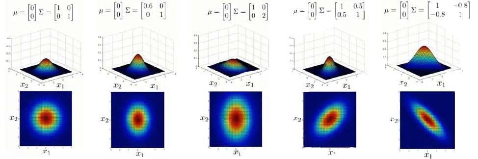
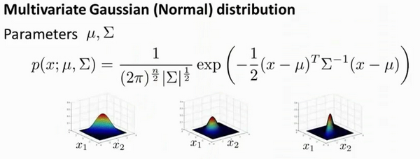

十五、异常检测(Anomaly Detection)
---------------------------------

### 15.1 问题的动机

参考文档: 15 - 1 - Problem Motivation (8 min).mkv

在接下来的一系列视频中，我将向大家介绍异常检测(**Anomaly detection**)问题。这是机器学习算法的一个常见应用。这种算法的一个有趣之处在于：它虽然主要用于非监督学习问题，但从某些角度看，它又类似于一些监督学习问题。

什么是异常检测呢？为了解释这个概念，让我举一个例子吧：

假想你是一个飞机引擎制造商，当你生产的飞机引擎从生产线上流出时，你需要进行**QA**(质量控制测试)，而作为这个测试的一部分，你测量了飞机引擎的一些特征变量，比如引擎运转时产生的热量，或者引擎的振动等等。

这样一来，你就有了一个数据集，从$x^{(1)}$到$x^{(m)}$，如果你生产了$m$个引擎的话，你将这些数据绘制成图表，看起来就是这个样子：

这里的每个点、每个叉，都是你的无标签数据。这样，异常检测问题可以定义如下：我们假设后来有一天，你有一个新的飞机引擎从生产线上流出，而你的新飞机引擎有特征变量$x_{test}$。所谓的异常检测问题就是：我们希望知道这个新的飞机引擎是否有某种异常，或者说，我们希望判断这个引擎是否需要进一步测试。因为，如果它看起来像一个正常的引擎，那么我们可以直接将它运送到客户那里，而不需要进一步的测试。

给定数据集 $x^{(1)},x^{(2)},..,x^{(m)}$，我们假使数据集是正常的，我们希望知道新的数据 $x_{test}$ 是不是异常的，即这个测试数据不属于该组数据的几率如何。我们所构建的模型应该能根据该测试数据的位置告诉我们其属于一组数据的可能性 $p(x)$。

上图中，在蓝色圈内的数据属于该组数据的可能性较高，而越是偏远的数据，其属于该组数据的可能性就越低。

这种方法称为密度估计，表达如下：

$$
if \quad p(x)
\begin{cases}
< \varepsilon & anomaly \\
> =\varepsilon & normal
\end{cases}
$$

欺诈检测：

$x^{(i)} = {用户的第i个活动特征}$

模型$p(x)$ 为我们其属于一组数据的可能性，通过$p(x) < \varepsilon$检测非正常用户。

异常检测主要用来识别欺骗。例如在线采集而来的有关用户的数据，一个特征向量中可能会包含如：用户多久登录一次，访问过的页面，在论坛发布的帖子数量，甚至是打字速度等。尝试根据这些特征构建一个模型，可以用这个模型来识别那些不符合该模式的用户。

再一个例子是检测一个数据中心，特征可能包含：内存使用情况，被访问的磁盘数量，**CPU**的负载，网络的通信量等。根据这些特征可以构建一个模型，用来判断某些计算机是不是有可能出错了。

### 15.2 高斯分布

参考视频: 15 - 2 - Gaussian Distribution (10 min).mkv

在这个视频中，我将介绍高斯分布，也称为正态分布。回顾高斯分布的基本知识。

通常如果我们认为变量 $x$ 符合高斯分布 $x \sim N(\mu, \sigma^2)$则其概率密度函数为：
$p(x,\mu,\sigma^2)=\frac{1}{\sqrt{2\pi}\sigma}\exp\left(-\frac{(x-\mu)^2}{2\sigma^2}\right)$
我们可以利用已有的数据来预测总体中的$μ$和$σ^2$的计算方法如下：
$\mu=\frac{1}{m}\sum\limits_{i=1}^{m}x^{(i)}$

$\sigma^2=\frac{1}{m}\sum\limits_{i=1}^{m}(x^{(i)}-\mu)^2$

高斯分布样例：

注：机器学习中对于方差我们通常只除以$m$而非统计学中的$(m-1)$。这里顺便提一下，在实际使用中，到底是选择使用$1/m$还是$1/(m-1)$其实区别很小，只要你有一个还算大的训练集，在机器学习领域大部分人更习惯使用$1/m$这个版本的公式。这两个版本的公式在理论特性和数学特性上稍有不同，但是在实际使用中，他们的区别甚小，几乎可以忽略不计。

### 15.3 算法 

参考视频: 15 - 3 - Algorithm (12 min).mkv

在本节视频中，我将应用高斯分布开发异常检测算法。

异常检测算法：

对于给定的数据集 $x^{(1)},x^{(2)},...,x^{(m)}$，我们要针对每一个特征计算 $\mu$ 和 $\sigma^2$ 的估计值。

$\mu_j=\frac{1}{m}\sum\limits_{i=1}^{m}x_j^{(i)}$

$\sigma_j^2=\frac{1}{m}\sum\limits_{i=1}^m(x_j^{(i)}-\mu_j)^2$

一旦我们获得了平均值和方差的估计值，给定新的一个训练实例，根据模型计算 $p(x)$：

$p(x)=\prod\limits_{j=1}^np(x_j;\mu_j,\sigma_j^2)=\prod\limits_{j=1}^1\frac{1}{\sqrt{2\pi}\sigma_j}exp(-\frac{(x_j-\mu_j)^2}{2\sigma_j^2})$

当$p(x) < \varepsilon$时，为异常。

下图是一个由两个特征的训练集，以及特征的分布情况：

下面的三维图表表示的是密度估计函数，$z$轴为根据两个特征的值所估计$p(x)$值：

我们选择一个$\varepsilon$，将$p(x) = \varepsilon$作为我们的判定边界，当$p(x) > \varepsilon$时预测数据为正常数据，否则为异常。

在这段视频中，我们介绍了如何拟合$p(x)$，也就是 $x$的概率值，以开发出一种异常检测算法。同时，在这节课中，我们也给出了通过给出的数据集拟合参数，进行参数估计，得到参数 $\mu$ 和 $\sigma$，然后检测新的样本，确定新样本是否是异常。

在接下来的课程中，我们将深入研究这一算法，同时更深入地介绍，怎样让算法工作地更加有效。

### 15.4 开发和评价一个异常检测系统

参考视频: 15 - 4 - Developing and Evaluating an Anomaly Detection System (13 min). mkv

异常检测算法是一个非监督学习算法，意味着我们无法根据结果变量 $ y$ 的值来告诉我们数据是否真的是异常的。我们需要另一种方法来帮助检验算法是否有效。当我们开发一个异常检测系统时，我们从带标记（异常或正常）的数据着手，我们从其中选择一部分正常数据用于构建训练集，然后用剩下的正常数据和异常数据混合的数据构成交叉检验集和测试集。

例如：我们有10000台正常引擎的数据，有20台异常引擎的数据。 我们这样分配数据：

6000台正常引擎的数据作为训练集

2000台正常引擎和10台异常引擎的数据作为交叉检验集

2000台正常引擎和10台异常引擎的数据作为测试集

具体的评价方法如下：

1. 根据测试集数据，我们估计特征的平均值和方差并构建$p(x)$函数

2. 对交叉检验集，我们尝试使用不同的$\varepsilon$值作为阀值，并预测数据是否异常，根据$F1$值或者查准率与查全率的比例来选择 $\varepsilon$

3. 选出 $\varepsilon$ 后，针对测试集进行预测，计算异常检验系统的$F1$值，或者查准率与查全率之比

### 15.5 异常检测与监督学习对比

参考视频: 15 - 5 - Anomaly Detection vs. Supervised Learning (8 min).mkv

之前我们构建的异常检测系统也使用了带标记的数据，与监督学习有些相似，下面的对比有助于选择采用监督学习还是异常检测：

两者比较：

| 异常检测                                                     | 监督学习                                                     |
| ------------------------------------------------------------ | ------------------------------------------------------------ |
| 非常少量的正向类（异常数据 $y=1$）, 大量的负向类（$y=0$）    | 同时有大量的正向类和负向类                                   |
| 许多不同种类的异常，非常难。根据非常 少量的正向类数据来训练算法。 | 有足够多的正向类实例，足够用于训练 算法，未来遇到的正向类实例可能与训练集中的非常近似。 |
| 未来遇到的异常可能与已掌握的异常、非常的不同。               |                                                              |
| 例如： 欺诈行为检测 生产（例如飞机引擎）检测数据中心的计算机运行状况 | 例如：邮件过滤器 天气预报 肿瘤分类                           |

希望这节课能让你明白一个学习问题的什么样的特征，能让你把这个问题当做是一个异常检测，或者是一个监督学习的问题。另外，对于很多技术公司可能会遇到的一些问题，通常来说，正样本的数量很少，甚至有时候是0，也就是说，出现了太多没见过的不同的异常类型，那么对于这些问题，通常应该使用的算法就是异常检测算法。

### 15.6 选择特征

参考视频: 15 - 6 - Choosing What Features to Use (12 min).mkv

对于异常检测算法，我们使用的特征是至关重要的，下面谈谈如何选择特征：

异常检测假设特征符合高斯分布，如果数据的分布不是高斯分布，异常检测算法也能够工作，但是最好还是将数据转换成高斯分布，例如使用对数函数：$x= log(x+c)$，其中 $c$ 为非负常数； 或者 $x=x^c$，$c$为 0-1 之间的一个分数，等方法。(编者注：在**python**中，通常用`np.log1p()`函数，$log1p$就是 $log(x+1)$，可以避免出现负数结果，反向函数就是`np.expm1()`)

误差分析：

一个常见的问题是一些异常的数据可能也会有较高的$p(x)$值，因而被算法认为是正常的。这种情况下误差分析能够帮助我们，我们可以分析那些被算法错误预测为正常的数据，观察能否找出一些问题。我们可能能从问题中发现我们需要增加一些新的特征，增加这些新特征后获得的新算法能够帮助我们更好地进行异常检测。

异常检测误差分析：

我们通常可以通过将一些相关的特征进行组合，来获得一些新的更好的特征（异常数据的该特征值异常地大或小），例如，在检测数据中心的计算机状况的例子中，我们可以用**CPU**负载与网络通信量的比例作为一个新的特征，如果该值异常地大，便有可能意味着该服务器是陷入了一些问题中。

在这段视频中，我们介绍了如何选择特征，以及对特征进行一些小小的转换，让数据更像正态分布，然后再把数据输入异常检测算法。同时也介绍了建立特征时，进行的误差分析方法，来捕捉各种异常的可能。希望你通过这些方法，能够了解如何选择好的特征变量，从而帮助你的异常检测算法，捕捉到各种不同的异常情况。

### 15.7 多元高斯分布（选修）

参考视频: 15 - 7 - Multivariate Gaussian Distribution (Optional) (14 min).mkv

假使我们有两个相关的特征，而且这两个特征的值域范围比较宽，这种情况下，一般的高斯分布模型可能不能很好地识别异常数据。其原因在于，一般的高斯分布模型尝试的是去同时抓住两个特征的偏差，因此创造出一个比较大的判定边界。

下图中是两个相关特征，洋红色的线（根据ε的不同其范围可大可小）是一般的高斯分布模型获得的判定边界，很明显绿色的**X**所代表的数据点很可能是异常值，但是其$p(x)$值却仍然在正常范围内。多元高斯分布将创建像图中蓝色曲线所示的判定边界。

在一般的高斯分布模型中，我们计算 $p(x)$ 的方法是：
通过分别计算每个特征对应的几率然后将其累乘起来，在多元高斯分布模型中，我们将构建特征的协方差矩阵，用所有的特征一起来计算 $p(x)$。

我们首先计算所有特征的平均值，然后再计算协方差矩阵：
$p(x)=\prod_{j=1}^np(x_j;\mu,\sigma_j^2)=\prod_{j=1}^n\frac{1}{\sqrt{2\pi}\sigma_j}exp(-\frac{(x_j-\mu_j)^2}{2\sigma_j^2})$

$\mu=\frac{1}{m}\sum_{i=1}^mx^{(i)}$

$\Sigma = \frac{1}{m}\sum_{i=1}^m(x^{(i)}-\mu)(x^{(i)}-\mu)^T=\frac{1}{m}(X-\mu)^T(X-\mu)$

注:其中$\mu $ 是一个向量，其每一个单元都是原特征矩阵中一行数据的均值。最后我们计算多元高斯分布的$p\left( x \right)$:
$p(x)=\frac{1}{(2\pi)^{\frac{n}{2}}|\Sigma|^{\frac{1}{2}}}exp\left(-\frac{1}{2}(x-\mu)^T\Sigma^{-1}(x-\mu)\right)$
其中：

$|\Sigma|$是定矩阵，在 **Octave** 中用 `det(sigma)`计算

$\Sigma^{-1}$ 是逆矩阵，下面我们来看看协方差矩阵是如何影响模型的：

上图是5个不同的模型，从左往右依次分析：

1. 是一个一般的高斯分布模型

2. 通过协方差矩阵，令特征1拥有较小的偏差，同时保持特征2的偏差

3. 通过协方差矩阵，令特征2拥有较大的偏差，同时保持特征1的偏差

4. 通过协方差矩阵，在不改变两个特征的原有偏差的基础上，增加两者之间的正相关性

5. 通过协方差矩阵，在不改变两个特征的原有偏差的基础上，增加两者之间的负相关性

多元高斯分布模型与原高斯分布模型的关系：

可以证明的是，原本的高斯分布模型是多元高斯分布模型的一个子集，即像上图中的第1、2、3，3个例子所示，如果协方差矩阵只在对角线的单位上有非零的值时，即为原本的高斯分布模型了。

原高斯分布模型和多元高斯分布模型的比较：

| 原高斯分布模型                                               | 多元高斯分布模型                                             |
| ------------------------------------------------------------ | ------------------------------------------------------------ |
| 不能捕捉特征之间的相关性 但可以通过将特征进行组合的方法来解决 | 自动捕捉特征之间的相关性                                     |
| 计算代价低，能适应大规模的特征                               | 计算代价较高 训练集较小时也同样适用                          |
|                                                              | 必须要有 $m>n$，不然的话协方差矩阵$\Sigma$不可逆的，通常需要 $m>10n$ 另外特征冗余也会导致协方差矩阵不可逆 |

原高斯分布模型被广泛使用着，如果特征之间在某种程度上存在相互关联的情况，我们可以通过构造新新特征的方法来捕捉这些相关性。

如果训练集不是太大，并且没有太多的特征，我们可以使用多元高斯分布模型。

### 15.8 使用多元高斯分布进行异常检测（可选）

参考视频: 15 - 8 - Anomaly Detection using the Multivariate Gaussian Distribution (Optional) (14 min).mkv

在我们谈到的最后一个视频，关于多元高斯分布，看到的一些建立的各种分布模型，当你改变参数，$\mu$ 和 $\Sigma$。在这段视频中，让我们用这些想法，并应用它们制定一个不同的异常检测算法。

要回顾一下多元高斯分布和多元正态分布：

分布有两个参数， $\mu$ 和 $\Sigma$。其中$\mu$这一个$n$维向量和 $\Sigma$ 的协方差矩阵，是一种$n\times n$的矩阵。而这里的公式$x$的概率，如按 $\mu$ 和参数化 $\Sigma$，和你的变量 $\mu$ 和 $\Sigma$，你可以得到一个范围的不同分布一样，你知道的，这些都是三个样本，那些我们在以前的视频看过了。

因此，让我们谈谈参数拟合或参数估计问题：

我有一组样本${{{ x^{(1)},x^{(2)},...,x^{(m)}} }}$是一个$n$维向量，我想我的样本来自一个多元高斯分布。我如何尝试估计我的参数 $\mu$ 和 $\Sigma$ 以及标准公式？

估计他们是你设置 $\mu$ 是你的训练样本的平均值。

$\mu=\frac{1}{m}\sum_{i=1}^{m}x^{(i)}$
并设置$\Sigma$：
$\Sigma=\frac{1}{m}\sum_{i=1}^{m}(x^{(i)}-\mu)(x^{(i)}-\mu)^T$
这其实只是当我们使用**PCA**算法时候，有 $\Sigma$ 时写出来。所以你只需插入上述两个公式，这会给你你估计的参数 $\mu$ 和你估计的参数 $\Sigma$。所以，这里给出的数据集是你如何估计 $\mu$ 和 $\Sigma$。让我们以这种方法而只需将其插入到异常检测算法。那么，我们如何把所有这一切共同开发一个异常检测算法？

首先，我们把我们的训练集，和我们的拟合模型，我们计算$p(x)$，要知道，设定$\mu$和描述的一样$\Sigma$。

如图，该分布在中央最多，越到外面的圈的范围越小。

并在该点是出路这里的概率非常低。

原始模型与多元高斯模型的关系如图：

其中：协方差矩阵$\Sigma$为：

原始模型和多元高斯分布比较如图：

