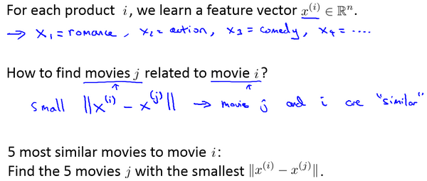

十六、推荐系统(Recommender Systems)
-----------------------------------

### 16.1 问题形式化

参考视频: 16 - 1 - Problem Formulation (8 min).mkv

在接下来的视频中，我想讲一下推荐系统。我想讲推荐系统有两个原因：

第一、仅仅因为它是机器学习中的一个重要的应用。在过去几年，我偶尔访问硅谷不同的技术公司，我常和工作在这儿致力于机器学习应用的人们聊天，我常问他们，最重要的机器学习的应用是什么，或者，你最想改进的机器学习应用有哪些。我最常听到的答案是推荐系统。现在，在硅谷有很多团体试图建立很好的推荐系统。因此，如果你考虑网站像亚马逊，或网飞公司或易趣，或**iTunes Genius**，有很多的网站或系统试图推荐新产品给用户。如，亚马逊推荐新书给你，网飞公司试图推荐新电影给你，等等。这些推荐系统，根据浏览你过去买过什么书，或过去评价过什么电影来判断。这些系统会带来很大一部分收入，比如为亚马逊和像网飞这样的公司。因此，对推荐系统性能的改善，将对这些企业的有实质性和直接的影响。

推荐系统是个有趣的问题，在学术机器学习中因此，我们可以去参加一个学术机器学习会议，推荐系统问题实际上受到很少的关注，或者，至少在学术界它占了很小的份额。但是，如果你看正在发生的事情，许多有能力构建这些系统的科技企业，他们似乎在很多企业中占据很高的优先级。这是我为什么在这节课讨论它的原因之一。

我想讨论推荐系统地第二个原因是：这个班视频的最后几集我想讨论机器学习中的一些大思想，并和大家分享。这节课我们也看到了，对机器学习来说，特征是很重要的，你所选择的特征，将对你学习算法的性能有很大的影响。因此，在机器学习中有一种大思想，它针对一些问题，可能并不是所有的问题，而是一些问题，有算法可以为你自动学习一套好的特征。因此，不要试图手动设计，而手写代码这是目前为止我们常干的。有一些设置，你可以有一个算法，仅仅学习其使用的特征，推荐系统就是类型设置的一个例子。还有很多其它的，但是通过推荐系统，我们将领略一小部分特征学习的思想，至少，你将能够了解到这方面的一个例子，我认为，机器学习中的大思想也是这样。因此，让我们开始讨论推荐系统问题形式化。

我们从一个例子开始定义推荐系统的问题。

假使我们是一个电影供应商，我们有 5 部电影和 4 个用户，我们要求用户为电影打分。

前三部电影是爱情片，后两部则是动作片，我们可以看出**Alice**和**Bob**似乎更倾向与爱情片， 而 **Carol** 和 **Dave** 似乎更倾向与动作片。并且没有一个用户给所有的电影都打过分。我们希望构建一个算法来预测他们每个人可能会给他们没看过的电影打多少分，并以此作为推荐的依据。

下面引入一些标记：

$n_u$ 代表用户的数量

$n_m$ 代表电影的数量

$r(i, j)$ 如果用户j给电影 $i$ 评过分则 $r(i,j)=1$

$y^{(i, j)}$ 代表用户 $j$ 给电影$i$的评分

$m_j$代表用户 $j$ 评过分的电影的总数

### 16.2 基于内容的推荐系统

参考视频: 16 - 2 - Content Based Recommendations (15 min).mkv

在一个基于内容的推荐系统算法中，我们假设对于我们希望推荐的东西有一些数据，这些数据是有关这些东西的特征。

在我们的例子中，我们可以假设每部电影都有两个特征，如$x_1$代表电影的浪漫程度，$x_2$ 代表电影的动作程度。

则每部电影都有一个特征向量，如$x^{(1)}$是第一部电影的特征向量为[0.9 0]。

下面我们要基于这些特征来构建一个推荐系统算法。
假设我们采用线性回归模型，我们可以针对每一个用户都训练一个线性回归模型，如${{\theta }^{(1)}}$是第一个用户的模型的参数。
于是，我们有：

$\theta^{(j)}$用户 $j$ 的参数向量

$x^{(i)}$电影 $i$ 的特征向量

对于用户 $j$ 和电影 $i$，我们预测评分为：$(\theta^{(j)})^T x^{(i)}$

代价函数

针对用户 $j$，该线性回归模型的代价为预测误差的平方和，加上正则化项：
$$
\min_{\theta (j)}\frac{1}{2}\sum_{i:r(i,j)=1}\left((\theta^{(j)})^Tx^{(i)}-y^{(i,j)}\right)^2+\frac{\lambda}{2}\left(\theta_{k}^{(j)}\right)^2
$$

其中 $i:r(i,j)$表示我们只计算那些用户 $j$ 评过分的电影。在一般的线性回归模型中，误差项和正则项应该都是乘以$1/2m$，在这里我们将$m$去掉。并且我们不对方差项$\theta_0$进行正则化处理。

上面的代价函数只是针对一个用户的，为了学习所有用户，我们将所有用户的代价函数求和：
$$
\min_{\theta^{(1)},...,\theta^{(n_u)}} \frac{1}{2}\sum_{j=1}^{n_u}\sum_{i:r(i,j)=1}\left((\theta^{(j)})^Tx^{(i)}-y^{(i,j)}\right)^2+\frac{\lambda}{2}\sum_{j=1}^{n_u}\sum_{k=1}^{n}(\theta_k^{(j)})^2
$$
如果我们要用梯度下降法来求解最优解，我们计算代价函数的偏导数后得到梯度下降的更新公式为：

$$
\theta_k^{(j)}:=\theta_k^{(j)}-\alpha\sum_{i:r(i,j)=1}((\theta^{(j)})^Tx^{(i)}-y^{(i,j)})x_{k}^{(i)} \quad (\text{for} \, k = 0)
$$

$$
\theta_k^{(j)}:=\theta_k^{(j)}-\alpha\left(\sum_{i:r(i,j)=1}((\theta^{(j)})^Tx^{(i)}-y^{(i,j)})x_{k}^{(i)}+\lambda\theta_k^{(j)}\right) \quad (\text{for} \, k\neq 0)
$$

### 16.3 协同过滤

参考视频: 16 - 3 - Collaborative Filtering (10 min).mkv

在之前的基于内容的推荐系统中，对于每一部电影，我们都掌握了可用的特征，使用这些特征训练出了每一个用户的参数。相反地，如果我们拥有用户的参数，我们可以学习得出电影的特征。

$$
\mathop{min}\limits_{x^{(1)},...,x^{(n_m)}}\frac{1}{2}\sum_{i=1}^{n_m}\sum_{j{r(i,j)=1}}((\theta^{(j)})^Tx^{(i)}-y^{(i,j)})^2+\frac{\lambda}{2}\sum_{i=1}^{n_m}\sum_{k=1}^{n}(x_k^{(i)})^2
$$
但是如果我们既没有用户的参数，也没有电影的特征，这两种方法都不可行了。协同过滤算法可以同时学习这两者。

我们的优化目标便改为同时针对$x$和$\theta$进行。
$$
J(x^{(1)},...x^{(n_m)},\theta^{(1)},...,\theta^{(n_u)})=\frac{1}{2}\sum_{(i:j):r(i,j)=1}((\theta^{(j)})^Tx^{(i)}-y^{(i,j)})^2+\frac{\lambda}{2}\sum_{i=1}^{n_m}\sum_{k=1}^{n}(x_k^{(j)})^2+\frac{\lambda}{2}\sum_{j=1}^{n_u}\sum_{k=1}^{n}(\theta_k^{(j)})^2
$$

对代价函数求偏导数的结果如下：

$$
x_k^{(i)}:=x_k^{(i)}-\alpha\left(\sum_{j:r(i,j)=1}((\theta^{(j)})^Tx^{(i)}-y^{(i,j)}\theta_k^{j}+\lambda x_k^{(i)}\right)
$$

$$
\theta_k^{(i)}:=\theta_k^{(i)}-\alpha\left(\sum_{i:r(i,j)=1}((\theta^{(j)})^Tx^{(i)}-y^{(i,j)}x_k^{(i)}+\lambda \theta_k^{(j)}\right)
$$

注：在协同过滤从算法中，我们通常不使用方差项，如果需要的话，算法会自动学得。
协同过滤算法使用步骤如下：

1. 初始 $x^{(1)},x^{(1)},...x^{(nm)},\ \theta^{(1)},\theta^{(2)},...,\theta^{(n_u)}$为一些随机小值

2. 使用梯度下降算法最小化代价函数

3. 在训练完算法后，我们预测$(\theta^{(j)})^Tx^{(i)}$为用户 $j$ 给电影 $i$ 的评分

通过这个学习过程获得的特征矩阵包含了有关电影的重要数据，这些数据不总是人能读懂的，但是我们可以用这些数据作为给用户推荐电影的依据。

例如，如果一位用户正在观看电影 $x^{(i)}$，我们可以寻找另一部电影$x^{(j)}$，依据两部电影的特征向量之间的距离$\left\| {{x}^{(i)}}-{{x}^{(j)}} \right\|$的大小。

### 16.4 协同过滤算法

参考视频: 16 - 4 - Collaborative Filtering Algorithm (9 min).mkv

协同过滤优化目标：

给定$x^{(1)},...,x^{(n_m)}$，估计$\theta^{(1)},...,\theta^{(n_u)}$：
$$
\min_{\theta^{(1)},...,\theta^{(n_u)}}\frac{1}{2}\sum_{j=1}^{n_u}\sum_{i:r(i,j)=1}((\theta^{(j)})^Tx^{(i)}-y^{(i,j)})^2+\frac{\lambda}{2}\sum_{j=1}^{n_u}\sum_{k=1}^{n}(\theta_k^{(j)})^2
$$

给定$\theta^{(1)},...,\theta^{(n_u)}$，估计$x^{(1)},...,x^{(n_m)}$：

同时最小化$x^{(1)},...,x^{(n_m)}$和$\theta^{(1)},...,\theta^{(n_u)}$：
$$
J(x^{(1)},...,x^{(n_m)},\theta^{(1)},...,\theta^{(n_u)})=\frac{1}{2}\sum_{(i,j):r(i,j)=1}((\theta^{(j)})^Tx^{(i)}-y^{(i,j)})^2+\frac{\lambda}{2}\sum_{i=1}^{n_m}\sum_{k=1}^{n}(x_k^{(i)})^2+\frac{\lambda}{2}\sum_{j=1}^{n_u}\sum_{k=1}^{n}(\theta_k^{(j)})^2
$$

$$
\min_{x^{(1)},...,x^{(n_m)} \\\ \theta^{(1)},...,\theta^{(n_u)}}J(x^{(1)},...,x^{(n_m)},\theta^{(1)},...,\theta^{(n_u)})
$$

### 16.5 向量化：低秩矩阵分解

参考视频: 16 - 5 - Vectorization\_ Low Rank Matrix Factorization (8 min).mkv

在上几节视频中，我们谈到了协同过滤算法，本节视频中我将会讲到有关该算法的向量化实现，以及说说有关该算法你可以做的其他事情。

举例子：

1. 当给出一件产品时，你能否找到与之相关的其它产品。

2. 一位用户最近看上一件产品，有没有其它相关的产品，你可以推荐给他。

我将要做的是：实现一种选择的方法，写出协同过滤算法的预测情况。

我们有关于五部电影的数据集，我将要做的是，将这些用户的电影评分，进行分组并存到一个矩阵中。

我们有五部电影，以及四位用户，那么 这个矩阵 $Y$ 就是一个5行4列的矩阵，它将这些电影的用户评分数据都存在矩阵里：

| **Movie**            | **Alice (1)** | **Bob (2)** | **Carol (3)** | **Dave (4)** |
| -------------------- | ------------- | ----------- | ------------- | ------------ |
| Love at last         | 5             | 5           | 0             | 0            |
| Romance forever      | 5             | ?           | ?             | 0            |
| Cute puppies of love | ?             | 4           | 0             | ?            |
| Nonstop car chases   | 0             | 0           | 5             | 4            |
| Swords vs. karate    | 0             | 0           | 5             | ?            |

推出评分：

找到相关影片：

现在既然你已经对特征参数向量进行了学习，那么我们就会有一个很方便的方法来度量两部电影之间的相似性。例如说：电影 $i$ 有一个特征向量$x^{(i)}$，你是否能找到一部不同的电影 $j$，保证两部电影的特征向量之间的距离$x^{(i)}$和$x^{(j)}$很小，那就能很有力地表明电影$i$和电影 $j$ 在某种程度上有相似，至少在某种意义上，某些人喜欢电影 $i$，或许更有可能也对电影 $j$ 感兴趣。总结一下，当用户在看某部电影 $i$ 的时候，如果你想找5部与电影非常相似的电影，为了能给用户推荐5部新电影，你需要做的是找出电影 $j$，在这些不同的电影中与我们要找的电影 $i$ 的距离最小，这样你就能给你的用户推荐几部不同的电影了。

通过这个方法，希望你能知道，如何进行一个向量化的计算来对所有的用户和所有的电影进行评分计算。同时希望你也能掌握，通过学习特征参数，来找到相关电影和产品的方法。

### 16.6 推行工作上的细节：均值归一化

参考视频: 16 - 6 - Implementational Detail\_ Mean Normalization (9 min).mkv

让我们来看下面的用户评分数据：

如果我们新增一个用户 **Eve**，并且 **Eve** 没有为任何电影评分，那么我们以什么为依据为**Eve**推荐电影呢？

我们首先需要对结果 $Y $矩阵进行均值归一化处理，将每一个用户对某一部电影的评分减去所有用户对该电影评分的平均值：

然后我们利用这个新的 $Y$ 矩阵来训练算法。
如果我们要用新训练出的算法来预测评分，则需要将平均值重新加回去，预测$(\theta^{(j)})^T x^{(i)}+\mu_i$，对于**Eve**，我们的新模型会认为她给每部电影的评分都是该电影的平均分。