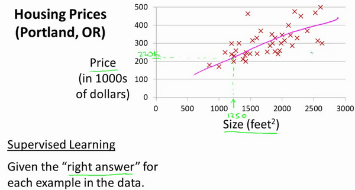
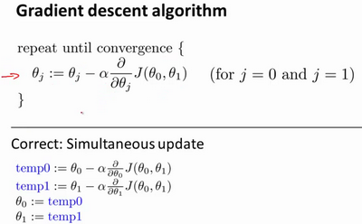

## 二、单变量线性回归(Linear Regression with One Variable)

-------------------------------------------------------

### 2.1 模型表示

参考视频: 2 - 1 - Model Representation (8 min).mkv

我们的第一个学习算法是线性回归算法。在这段视频中，你会看到这个算法的概况，更重要的是你将会了解监督学习过程完整的流程。

让我们通过一个例子来开始：这个例子是预测住房价格的，我们要使用一个数据集，数据集包含俄勒冈州波特兰市的住房价格。在这里，我要根据不同房屋尺寸所售出的价格，画出我的数据集。比方说，如果你朋友的房子是1250平方尺大小，你要告诉他们这房子能卖多少钱。那么，你可以做的一件事就是构建一个模型，也许是条直线，从这个数据模型上来看，也许你可以告诉你的朋友，他能以大约220000(美元)左右的价格卖掉这个房子。这就是监督学习算法的一个例子。

它被称作监督学习是因为对于每个数据来说，我们给出了“正确的答案”，即告诉我们：根据我们的数据来说，房子实际的价格是多少，而且，更具体来说，这是一个回归问题。回归一词指的是，我们根据之前的数据预测出一个准确的输出值，对于这个例子就是价格，同时，还有另一种最常见的监督学习方式，叫做分类问题，当我们想要预测离散的输出值，例如，我们正在寻找癌症肿瘤，并想要确定肿瘤是良性的还是恶性的，这就是0/1离散输出的问题。更进一步来说，在监督学习中我们有一个数据集，这个数据集被称训练集。

**我将在整个课程中用小写的$m$来表示训练样本的数目。**

以之前的房屋交易问题为例，假使我们回归问题的训练集（**Training Set**）如下表所示：

我们将要用来描述这个回归问题的标记如下:

$m$ 代表训练集中实例的数量

$x$  代表特征/输入变量

$y$ 代表目标变量/输出变量

$\left( x,y \right)$ 代表训练集中的实例

$({{x}^{(i)}},{{y}^{(i)}})$ 代表第$i$ 个观察实例

$h$  代表学习算法的解决方案或函数也称为假设（**hypothesis**）

这就是一个监督学习算法的工作方式，我们可以看到这里有我们的训练集里房屋价格
我们把它喂给我们的学习算法，学习算法的工作了，然后输出一个函数，通常表示为小写 $h$  表示。$h$  代表**hypothesis**(**假设**)，$h$表示一个函数，输入是房屋尺寸大小，就像你朋友想出售的房屋，因此 $h$ 根据输入的 $x$值来得出 $y$ 值，$y$ 值对应房子的价格 因此，$h$ 是一个从$x$ 到 $y$ 的函数映射。

我将选择最初的使用规则$h$代表**hypothesis**，因而，要解决房价预测问题，我们实际上是要将训练集“喂”给我们的学习算法，进而学习得到一个假设$h$，然后将我们要预测的房屋的尺寸作为输入变量输入给$h$，预测出该房屋的交易价格作为输出变量输出为结果。那么，对于我们的房价预测问题，我们该如何表达 $h$？

一种可能的表达方式为：$h_\theta \left( x \right)=\theta_{0} + \theta_{1}x$，因为只含有一个特征/输入变量，因此这样的问题叫作单变量线性回归问题。

### 2.2 代价函数

参考视频: 2 - 2 - Cost Function (8 min).mkv

在这段视频中我们将定义代价函数的概念，这有助于我们弄清楚如何把最有可能的直线与我们的数据相拟合。如图：

在线性回归中我们有一个像这样的训练集，$m$代表了训练样本的数量，比如 $m = 47$。而我们的假设函数，也就是用来进行预测的函数，是这样的线性函数形式：$h_\theta \left( x \right)=\theta_{0}+\theta_{1}x$。

接下来我们会引入一些术语我们现在要做的便是为我们的模型选择合适的**参数**（**parameters**）$\theta_{0}$ 和 $\theta_{1}$，在房价问题这个例子中便是直线的斜率和在$y$ 轴上的截距。

我们选择的参数决定了我们得到的直线相对于我们的训练集的准确程度，模型所预测的值与训练集中实际值之间的差距（下图中蓝线所指）就是**建模误差**（**modeling error**）。

我们的目标便是选择出可以使得建模误差的平方和能够最小的模型参数。 即使得代价函数 $J \left( \theta_0, \theta_1 \right) = \frac{1}{2m}\sum\limits_{i=1}^m \left( h_{\theta}(x^{(i)})-y^{(i)} \right)^{2}$最小。

我们绘制一个等高线图，三个坐标分别为$\theta_{0}$和$\theta_{1}$ 和$J(\theta_{0}, \theta_{1})$：

则可以看出在三维空间中存在一个使得$J(\theta_{0}, \theta_{1})$最小的点。

代价函数也被称作平方误差函数，有时也被称为平方误差代价函数。我们之所以要求出误差的平方和，是因为误差平方代价函数，对于大多数问题，特别是回归问题，都是一个合理的选择。还有其他的代价函数也能很好地发挥作用，但是平方误差代价函数可能是解决回归问题最常用的手段了。

在后续课程中，我们还会谈论其他的代价函数，但我们刚刚讲的选择是对于大多数线性回归问题非常合理的。

也许这个函数$J(\theta_{0}, \theta_{1})$有点抽象，可能你仍然不知道它的内涵，在接下来的几个视频里，我们要更进一步解释代价函数J的工作原理，并尝试更直观地解释它在计算什么，以及我们使用它的目的。

### 2.3 代价函数的直观理解I

参考视频: 2 - 3 - Cost Function - Intuition I (11 min).mkv

在上一个视频中，我们给了代价函数一个数学上的定义。在这个视频里，让我们通过一些例子来获取一些直观的感受，看看代价函数到底是在干什么。

### 2.4 代价函数的直观理解II

参考视频: 2 - 4 - Cost Function - Intuition II (9 min).mkv

这节课中，我们将更深入地学习代价函数的作用，这段视频的内容假设你已经认识等高线图，如果你对等高线图不太熟悉的话，这段视频中的某些内容你可能会听不懂，但不要紧，如果你跳过这段视频的话，也没什么关系，不听这节课对后续课程理解影响不大。

代价函数的样子，等高线图，则可以看出在三维空间中存在一个使得$J(\theta_{0}, \theta_{1})$最小的点。

通过这些图形，我希望你能更好地理解这些代价函数$ J$所表达的值是什么样的，它们对应的假设是什么样的，以及什么样的假设对应的点，更接近于代价函数$J$的最小值。

当然，我们真正需要的是一种有效的算法，能够自动地找出这些使代价函数$J$取最小值的参数$\theta_{0}$和$\theta_{1}$来。

我们也不希望编个程序把这些点画出来，然后人工的方法来读出这些点的数值，这很明显不是一个好办法。我们会遇到更复杂、更高维度、更多参数的情况，而这些情况是很难画出图的，因此更无法将其可视化，因此我们真正需要的是编写程序来找出这些最小化代价函数的$\theta_{0}$和$\theta_{1}$的值，在下一节视频中，我们将介绍一种算法，能够自动地找出能使代价函数$J$最小化的参数$\theta_{0}$和$\theta_{1}$的值。

### 2.5 梯度下降

参考视频: 2 - 5 - Gradient Descent (11 min).mkv

梯度下降是一个用来求函数最小值的算法，我们将使用梯度下降算法来求出代价函数$J(\theta_{0}, \theta_{1})$ 的最小值。

梯度下降背后的思想是：开始时我们随机选择一个参数的组合$\left( {\theta_{0}},{\theta_{1}},......,{\theta_{n}} \right)$，计算代价函数，然后我们寻找下一个能让代价函数值下降最多的参数组合。我们持续这么做直到找到一个局部最小值（**local minimum**），因为我们并没有尝试完所有的参数组合，所以不能确定我们得到的局部最小值是否便是全局最小值（**global minimum**），选择不同的初始参数组合，可能会找到不同的局部最小值。

想象一下你正站立在山的这一点上，站立在你想象的公园这座红色山上，在梯度下降算法中，我们要做的就是旋转360度，看看我们的周围，并问自己要在某个方向上，用小碎步尽快下山。这些小碎步需要朝什么方向？如果我们站在山坡上的这一点，你看一下周围，你会发现最佳的下山方向，你再看看周围，然后再一次想想，我应该从什么方向迈着小碎步下山？然后你按照自己的判断又迈出一步，重复上面的步骤，从这个新的点，你环顾四周，并决定从什么方向将会最快下山，然后又迈进了一小步，并依此类推，直到你接近局部最低点的位置。

批量梯度下降（**batch gradient descent**）算法的公式为：

其中$a$是学习率（**learning rate**），它决定了我们沿着能让代价函数下降程度最大的方向向下迈出的步子有多大，在批量梯度下降中，我们每一次都同时让所有的参数减去学习速率乘以代价函数的导数。

在梯度下降算法中，还有一个更微妙的问题，梯度下降中，我们要更新${\theta_{0}}$和${\theta_{1}}$ ，当 $j=0$ 和$j=1$时，会产生更新，所以你将更新$J\left( {\theta_{0}} \right)$和$J\left( {\theta_{1}} \right)$。实现梯度下降算法的微妙之处是，在这个表达式中，如果你要更新这个等式，你需要同时更新${\theta_{0}}$和${\theta_{1}}$，我的意思是在这个等式中，我们要这样更新：

${\theta_{0}}$:= ${\theta_{0}}$ ，并更新${\theta_{1}}$:= ${\theta_{1}}$。

实现方法是：你应该计算公式右边的部分，通过那一部分计算出${\theta_{0}}$和${\theta_{1}}$的值，然后同时更新${\theta_{0}}$和${\theta_{1}}$。

让我进一步阐述这个过程：

在梯度下降算法中，这是正确实现同时更新的方法。我不打算解释为什么你需要同时更新，同时更新是梯度下降中的一种常用方法。我们之后会讲到，同步更新是更自然的实现方法。当人们谈到梯度下降时，他们的意思就是同步更新。

在接下来的视频中，我们要进入这个微分项的细节之中。我已经写了出来但没有真正定义，如果你已经修过微积分课程，如果你熟悉偏导数和导数，这其实就是这个微分项：

$\alpha \frac{\partial }{\partial {{\theta }_{0}}}J({{\theta }_{0}},{{\theta }_{1}})$，$\alpha \frac{\partial }{\partial {{\theta }_{1}}}J({{\theta }_{0}},{{\theta }_{1}})$。

如果你不熟悉微积分，不用担心，即使你之前没有看过微积分，或者没有接触过偏导数，在接下来的视频中，你会得到一切你需要知道，如何计算这个微分项的知识。

下一个视频中，希望我们能够给出实现梯度下降算法的所有知识 。

### 2.6 梯度下降的直观理解

参考视频: 2 - 6 - Gradient Descent Intuition (12 min).mkv

在之前的视频中，我们给出了一个数学上关于梯度下降的定义，本次视频我们更深入研究一下，更直观地感受一下这个算法是做什么的，以及梯度下降算法的更新过程有什么意义。梯度下降算法如下：

${\theta_{j}}:={\theta_{j}}-\alpha \frac{\partial }{\partial {\theta_{j}}}J\left(\theta \right)$

描述：对$\theta $赋值，使得$J\left( \theta  \right)$按梯度下降最快方向进行，一直迭代下去，最终得到局部最小值。其中$a$是学习率（**learning rate**），它决定了我们沿着能让代价函数下降程度最大的方向向下迈出的步子有多大。

对于这个问题，求导的目的，基本上可以说取这个红点的切线，就是这样一条红色的直线，刚好与函数相切于这一点，让我们看看这条红色直线的斜率，就是这条刚好与函数曲线相切的这条直线，这条直线的斜率正好是这个三角形的高度除以这个水平长度，现在，这条线有一个正斜率，也就是说它有正导数，因此，我得到的新的${\theta_{1}}$，${\theta_{1}}$更新后等于${\theta_{1}}$减去一个正数乘以$a$。

这就是我梯度下降法的更新规则：${\theta_{j}}:={\theta_{j}}-\alpha \frac{\partial }{\partial {\theta_{j}}}J\left( \theta  \right)$

让我们来看看如果$a$太小或$a$太大会出现什么情况：

如果$a$太小了，即我的学习速率太小，结果就是只能这样像小宝宝一样一点点地挪动，去努力接近最低点，这样就需要很多步才能到达最低点，所以如果$a$太小的话，可能会很慢，因为它会一点点挪动，它会需要很多步才能到达全局最低点。

如果$a$太大，那么梯度下降法可能会越过最低点，甚至可能无法收敛，下一次迭代又移动了一大步，越过一次，又越过一次，一次次越过最低点，直到你发现实际上离最低点越来越远，所以，如果$a$太大，它会导致无法收敛，甚至发散。

现在，我还有一个问题，当我第一次学习这个地方时，我花了很长一段时间才理解这个问题，如果我们预先把${\theta_{1}}$放在一个局部的最低点，你认为下一步梯度下降法会怎样工作？

假设你将${\theta_{1}}$初始化在局部最低点，在这儿，它已经在一个局部的最优处或局部最低点。结果是局部最优点的导数将等于零，因为它是那条切线的斜率。这意味着你已经在局部最优点，它使得${\theta_{1}}$不再改变，也就是新的${\theta_{1}}$等于原来的${\theta_{1}}$，因此，如果你的参数已经处于局部最低点，那么梯度下降法更新其实什么都没做，它不会改变参数的值。这也解释了为什么即使学习速率$a$保持不变时，梯度下降也可以收敛到局部最低点。

我们来看一个例子，这是代价函数$J\left( \theta  \right)$。

我想找到它的最小值，首先初始化我的梯度下降算法，在那个品红色的点初始化，如果我更新一步梯度下降，也许它会带我到这个点，因为这个点的导数是相当陡的。现在，在这个绿色的点，如果我再更新一步，你会发现我的导数，也即斜率，是没那么陡的。随着我接近最低点，我的导数越来越接近零，所以，梯度下降一步后，新的导数会变小一点点。然后我想再梯度下降一步，在这个绿点，我自然会用一个稍微跟刚才在那个品红点时比，再小一点的一步，到了新的红色点，更接近全局最低点了，因此这点的导数会比在绿点时更小。所以，我再进行一步梯度下降时，我的导数项是更小的，${\theta_{1}}$更新的幅度就会更小。所以随着梯度下降法的运行，你移动的幅度会自动变得越来越小，直到最终移动幅度非常小，你会发现，已经收敛到局部极小值。

回顾一下，在梯度下降法中，当我们接近局部最低点时，梯度下降法会自动采取更小的幅度，这是因为当我们接近局部最低点时，很显然在局部最低时导数等于零，所以当我们接近局部最低时，导数值会自动变得越来越小，所以梯度下降将自动采取较小的幅度，这就是梯度下降的做法。所以实际上没有必要再另外减小$a$。

这就是梯度下降算法，你可以用它来最小化任何代价函数$J$，不只是线性回归中的代价函数$J$。

在接下来的视频中，我们要用代价函数$J$，回到它的本质，线性回归中的代价函数。也就是我们前面得出的平方误差函数，结合梯度下降法，以及平方代价函数，我们会得出第一个机器学习算法，即线性回归算法。

### 2.7 梯度下降的线性回归

参考视频: 2 - 7 - GradientDescentForLinearRegression (6 min).mkv

在以前的视频中我们谈到关于梯度下降算法，梯度下降是很常用的算法，它不仅被用在线性回归上和线性回归模型、平方误差代价函数。在这段视频中，我们要将梯度下降和代价函数结合。我们将用到此算法，并将其应用于具体的拟合直线的线性回归算法里。

梯度下降算法和线性回归算法比较如图：

对我们之前的线性回归问题运用梯度下降法，关键在于求出代价函数的导数，即：

$\frac{\partial }{\partial {{\theta }_{j}}}J({{\theta }_{0}},{{\theta }_{1}})=\frac{\partial }{\partial {{\theta }_{j}}}\frac{1}{2m}{{\sum\limits_{i=1}^{m}{\left( {{h}_{\theta }}({{x}^{(i)}})-{{y}^{(i)}} \right)}}^{2}}$

$j=0$  时：$\frac{\partial }{\partial {{\theta }_{0}}}J({{\theta }_{0}},{{\theta }_{1}})=\frac{1}{m}{{\sum\limits_{i=1}^{m}{\left( {{h}_{\theta }}({{x}^{(i)}})-{{y}^{(i)}} \right)}}}$

$j=1$  时：$\frac{\partial }{\partial {{\theta }_{1}}}J({{\theta }_{0}},{{\theta }_{1}})=\frac{1}{m}\sum\limits_{i=1}^{m}{\left( \left( {{h}_{\theta }}({{x}^{(i)}})-{{y}^{(i)}} \right)\cdot {{x}^{(i)}} \right)}$

则算法改写成：

**Repeat {**

​                ${\theta_{0}}:={\theta_{0}}-a\frac{1}{m}\sum\limits_{i=1}^{m}{ \left({{h}_{\theta }}({{x}^{(i)}})-{{y}^{(i)}} \right)}$

​                ${\theta_{1}}:={\theta_{1}}-a\frac{1}{m}\sum\limits_{i=1}^{m}{\left( \left({{h}_{\theta }}({{x}^{(i)}})-{{y}^{(i)}} \right)\cdot {{x}^{(i)}} \right)}$

​               **}**

我们刚刚使用的算法，有时也称为批量梯度下降。实际上，在机器学习中，通常不太会给算法起名字，但这个名字”**批量梯度下降**”，指的是在梯度下降的每一步中，我们都用到了所有的训练样本，在梯度下降中，在计算微分求导项时，我们需要进行求和运算，所以，在每一个单独的梯度下降中，我们最终都要计算这样一个东西，这个项需要对所有$m$个训练样本求和。因此，批量梯度下降法这个名字说明了我们需要考虑所有这一"批"训练样本，而事实上，有时也有其他类型的梯度下降法，不是这种"批量"型的，不考虑整个的训练集，而是每次只关注训练集中的一些小的子集。在后面的课程中，我们也将介绍这些方法。

但就目前而言，应用刚刚学到的算法，你应该已经掌握了批量梯度算法，并且能把它应用到线性回归中了，这就是用于线性回归的梯度下降法。

如果你之前学过线性代数，有些同学之前可能已经学过高等线性代数，你应该知道有一种计算代价函数$J$最小值的数值解法，不需要梯度下降这种迭代算法。在后面的课程中，我们也会谈到这个方法，它可以在不需要多步梯度下降的情况下，也能解出代价函数$J$的最小值，这是另一种称为正规方程(**normal equations**)的方法。实际上在数据量较大的情况下，梯度下降法比正规方程要更适用一些。

现在我们已经掌握了梯度下降，我们可以在不同的环境中使用梯度下降法，我们还将在不同的机器学习问题中大量地使用它。所以，祝贺大家成功学会你的第一个机器学习算法。

在下一段视频中，告诉你泛化的梯度下降算法，这将使梯度下降更加强大。

### 2.8 接下来的内容

参考视频: 2 - 8 - What_'s Next (6 min).mkv

在接下来的一组视频中，我会对线性代数进行一个快速的复习回顾。如果你从来没有接触过向量和矩阵，那么这课件上所有的一切对你来说都是新知识，或者你之前对线性代数有所了解，但由于隔得久了，对其有所遗忘，那就请学习接下来的一组视频，我会快速地回顾你将用到的线性代数知识。

通过它们，你可以实现和使用更强大的线性回归模型。事实上，线性代数不仅仅在线性回归中应用广泛，它其中的矩阵和向量将有助于帮助我们实现之后更多的机器学习模型，并在计算上更有效率。正是因为这些矩阵和向量提供了一种有效的方式来组织大量的数据，特别是当我们处理巨大的训练集时，如果你不熟悉线性代数，如果你觉得线性代数看上去是一个复杂、可怕的概念，特别是对于之前从未接触过它的人，不必担心，事实上，为了实现机器学习算法，我们只需要一些非常非常基础的线性代数知识。通过接下来几个视频，你可以很快地学会所有你需要了解的线性代数知识。具体来说，为了帮助你判断是否有需要学习接下来的一组视频，我会讨论什么是矩阵和向量，谈谈如何加、减 、乘矩阵和向量，讨论逆矩阵和转置矩阵的概念。

如果你十分熟悉这些概念，那么你完全可以跳过这组关于线性代数的选修视频，但是如果你对这些概念仍有些许的不确定，不确定这些数字或这些矩阵的意思，那么请看一看下一组的视频，它会很快地教你一些你需要知道的线性代数的知识，便于之后编写机器学习算法和处理大量数据。
